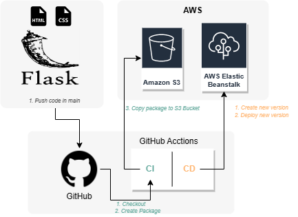

# mirceabularga.com

Status of Last Deployment: 
 

# Project propose:

    - To create a personal web page, with Flask framework. 
  
    - To configure github actions and create CI CD Pipeline.
  
    - To Deploy Flask app to AWS Elastic Beanstalk.
  

# CI/CD workflow diagram:

